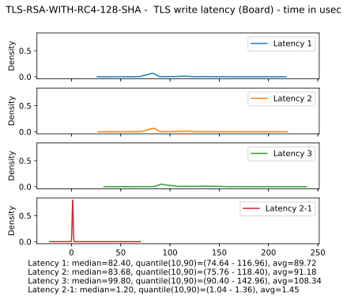
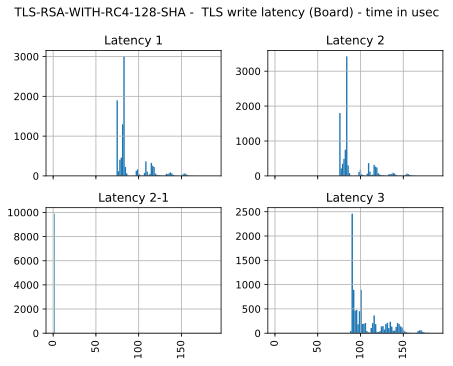
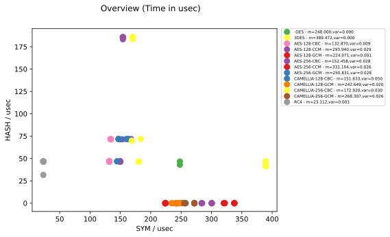
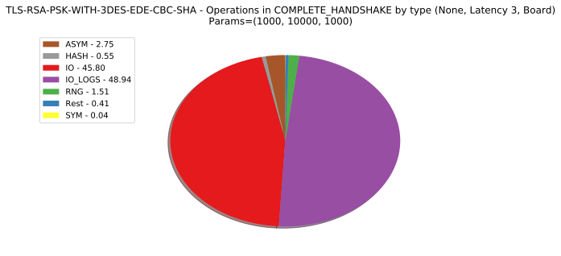

log storage
* SQLite (very homogenous data)
* split into multiple database files (performance)
* directory structure: <exp-ID>/<exp-type>/<Board or pc as server>/<cs-id>/<Pc or board>.ins
* ins for instrumentation

--

* dump list of all supported cipher suites by this built of mbed into file 
* reasons: explicit knowledge on current CS, builts for very constrained platforms may be stripped
* would have to do several builds and runs to test all CS

--

builder.py
* generates header for configuration and log labels
* builds mbed TLS and bench

--

Logging labels
* translated before compile time 
* combination of identifier and type
* type can either be primitive or compound ("meta")
* example: 
        PERFORM_BENCHMARK,META
becomes

        enum logging_label {
            PERFORM_BENCHMARK_START = 0;
            PERFORM_BENCHMARK_STOP = 1;
        }

Note:
* typically with _START and _STOP suffixes
* depending on identifier, actual labels are generated
* additional features possible (e.g. for use during analysis)
* Data structures
* logging_context
* logging_entry
* payload
* field for additional information
* could be used for arbitrary types or information
* example: energy consumption value

--

A closer look on latency (types)

--

* latency 1 = L2 − L1 − IO <!-- .element: class="fragment" data-fragment-index="1" -->
* latency 2 = L3 − L1 − IO <!-- .element: class="fragment" data-fragment-index="1" -->
* latency 3 = L3 − L1 <!-- .element: class="fragment" data-fragment-index="1" -->

Note:
* mbedtls_ssl_write function
* no knowledge beforehands where something TLS related is done and where I/O is involved
* latency: extra time spent in TLS layer
* question: from where to compute start / end?
* differentiate by: include post-processing? include IO?

--

* latency 1' = L3' − L1' − IO<!-- .element: class="fragment" data-fragment-index="1" -->
* latency 2' = L3' − L2' − IO<!-- .element: class="fragment" data-fragment-index="1" -->
* latency 3' = L3' − L1'<!-- .element: class="fragment" data-fragment-index="1" -->

Note:
* differentiate by: include tls pre-processing, include IO?

--

--

--

experiment 
* controller sends current CS to client
* (number of iterations, total payload size, size of a single packet)
* here (1000, 10000, 1000)
* since TLS asymmetric protocol: roles change

Note:
* read: each cipher suite was measured 1000 times. During each iteration,
a total of 10000 bytes was exchanged, where each packet was 1000 byte large

--

Internally
* client initiates and proceeds handshake 10 times
* after each channel establishment, 10x 1KB dummy payload is sent from client to server
* repeat after all cipher suites were used
* then start again (total: 100 iterations)
* reason: whole experiment for single CS takes very long. By splitting up,
already measured logs can be processed. Also, an "open end" scenario is thinkable

--

Text dump of the log tree

        [Start] CIPHER_SPEC - PROTO_STEP - stamp=75086081472920
            [Start] REC_SEND_IO - IO - stamp=75086081478182
            [Stop] REC_SEND_IO - IO - stamp=75086081480769 - duration=2.587
        [Stop] CIPHER_SPEC - PROTO_STEP - stamp=75086081482771 - duration=9.851

--

structure of mbed
* gained insight into library via callgrind (and KCachegrind)
* split into three libraries: crypto, tls, x509
* TLS protocols steps each have their own function 
* user provides network I/O callbacks <!-- .element: class="fragment" data-fragment-index="1" -->

Note:
* callback: we're able to exclude time spent in kernel for I/O

--

Winners
<table>
<tr>
<td>read</td><td>write</td><td>handshake initiator</td><td>handshake responder</td>
</tr>
<tr>
<td>69.92us</td><td>67.36us</td><td>1159.84us</td><td>1265.88us</td>
</tr>
<tr>
<td>RC4-128-MD5</td><td>RC4-128-MD5</td><td>PSK-WITH</td><td>PSK-WITH</td>
</tr>
</table>

Note:
* CS fixed set, no overall winner

--

Share of bulk cipher and hash algorithm in user data exchange

--

Note:
* idea: HW acceleration for symmetric cipher available
* cipher hence "fixed" for maximum performance. Which hash algo to use then?
* median time, based on 10x1000 read/write operations of 1KByte each
* GCM/CCM at 0 because MAC in cipher mode integrated
* SHA256 reasonable choice

--

Note:
* for reference, also coloured by symmetric cipher

--

Note:
* for reference, how much time is spent in I/O?
* I/O: TLS, I/O logs: transportation of logs
* really makes sense to exclude I/O time

