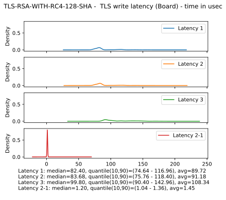
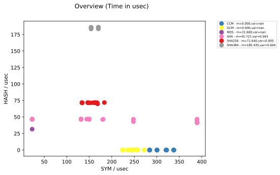

Outline

1. Background
2. Test bench
3. Results
4. Evaluation

--

Motivation
* IOT, Industry 4.0, cyber physical systems..
* huge number of: <!-- .element: class="fragment" data-fragment-index="1" -->
* resource constrained devices<!-- .element: class="fragment" data-fragment-index="1" -->
* connected to each other<!-- .element: class="fragment" data-fragment-index="1" -->
* real time requirements<!-- .element: class="fragment" data-fragment-index="1" -->
* How can we protect sensitive communication?   <!-- .element: class="fragment" data-fragment-index="2" -->

--

Hypothesis: TLS is suited for the protection of low-resource realtime systems
* low resource = limited RAM, persistent storage and computational capacity<!-- .element: class="fragment" data-fragment-index="1" -->
* realtime = fixed (and low!) latency<!-- .element: class="fragment" data-fragment-index="2" -->

--

<b>Latency = additional time that is necessary to pass through TLS layer</b>
* channel establishment: time before first packet can be sent
* user data: time before system IO function is reached

--

Verification in two steps:
1. development of a test bench <!-- .element: class="fragment" data-fragment-index="1" -->
2. evaluation of TLS on selected target platforms <!-- .element: class="fragment" data-fragment-index="2" -->

Note:
* first steps more extensive than thought
* evaluation only on TWR board (fast, has linux on it)

--

# Brief background on TLS

--

* relevant sub protocols: Handshake & record layer protocol 
Note:
* works on transport layer
* multi layered protocol

--

Note:
* client sends ClientHello with list of supported CS & TLS version
* if match: server responds with ServerHello, selects CS & TLS version
* server proves its identity, means described by cipher suite
* client generates random secret
* depending on CS, secret is securely transmitted to server
* symmetric keys are derived
* finally: hash over all protocol messages first message that's protected by established security parameters

--

Note:
* one of the very few dynamic components
* cryptographic operations dominate the runtime
* test all cipher suite for influence on latency

--

# test bench

--

Goal

* give user simple metrics by which cipher suites can be chosen
* provide tools to allow for deeper insights where necessary

--

mbed TLS
* ARMS's official TLS library
* supports almost all TLS features
* modular design

--

How to instrument?
* callgrind: excellent tool, just too heavy
* gprof: had a lot of quirks, also not sure if available on target platforms
* considered other papers and their approach, none really suited mine

--

Solution: home brew instrumentation
* small library linked to target code
* manual insertion of log points into the code
* label, time stamp and (optional) payload

--

API
* embracing log points form a log block
* Usage 
        int my_function(...) {
            log_point(MY_FUNCTION_START, global_log_ctx, 0);
            // do stuff
            log_point(MY_STUFF_START, global_log_ctx, 0);
            // do stuff
            log_point(MY_STUFF_STOP, global_log_ctx, 0);
            // do clean-up stuff
            log_point(MY_FUNCTION_STOP, global_log_ctx, 0);
            return result;
        }

Note:
* nested logs possible (and heavily used)
* time stamps with clock_gettime

--

Completeness
* assume single-threaded code
* target code can be surrounded by outer log label
* then complete execution time (plus noise) is captured
* nesting log points increases preciseness

--

Meta vs Primitive blocks
* <b>Meta</b>: large procedure  
(mbedtls_ssl_handshake) 
* <b>Primitive</b>: discrete algorithm 
(mbedtls_aes_encrypt) 
* ratio used to judge preciseness of instrumentation (coverage) <!-- .element: class="fragment" data-fragment-index="3" -->

--

What to instrument?
* cover protocol step functions
* cover the whole cryptographic API
* idea: most time is spent in cryptographic operations (high coverage!)

Note:
* mbed TLS comes with a built-in benchmark tool that measures raw crypto performance
* went through list of included header files to identify roughly all crypto functions
* perks: by instrumenting the function declaration and not explicit calls, all calls are
implicitly instrumented
* crypto functions considered to be "primitive" (no need to look insight them, impl. irrelevant)

--

Note:
* physical setup: TWR board, powerful tower PC and laptop connected through 1Gb ethernet
* bare bone linux installation
* board and tower run driver application, laptop controller
* virtual links: drivers speak TLS, controller and drivers use custom protocol

--

Note:
* controller assigns server /client roles
* CLI_INS_HANDSHAKE has parameter to enforce cipher suite
* for each cipher suite
    * client initiates handshake with server
    * after channel establishment, client sends packets to server
    * instrumented data is sent to the controller
* controller switches server / client roles
* repeat 
* if buffer full prematurely, then peer can indicate so to the controller

--

# Results
1. Overview
2. Toolset

--

# overview

--

Instrumented latency times (for each cipher suite)

* 1000 handshakes (initiator, responder)
* 10,000 reads / writes of 1KByte

--

Note:
* combined overview of handshake and user data exchange latencies
* y-axis: median time of 1000 handshakes (init / respond)
* x-axis: median time of 10x1000 user data exchange (1 kByte) (write / read)
* nice separation into layers parallel to x-axis
* bottom: PSK
* performance asymmetry: RSA performs well (client only encrypts)
* elliptic curves with average performance
* slowest: 'pure' DH

--

Note:
* separation into layers parallel to y-axis
* RC4 fastest (broken, but stream ciphers interesting, Salsa20)
* fastest secure cipher: AES 128 CBC
* 3DES unsurprisingly slowest
* same for handshake responder side, reading side - omitted due to time constraints

--

Recommendation
* read/write: AES-128-CBC (AES-128-GCM if AES hardware accelerated)
* handshake: PSK (if infrastructure available), RSA
* avoid 3DES and DH(E)
* reasonable choice: TLS-RSA-WITH-AES-128-GCM

--

# The toolbox

--

Note:
* idea: "Where exactly is time spent during the handshake?"
* outer bar: total handshake time
* inner bars: protocol steps
* y-axis: linear time in micro seconds
* steps in chronological order
* 1000 iterations, median time of each protocol step
* presentational approach can be used for any kinds of labels, also arbitrarly deep

--

Note:
* idea: "Which types of cryptographic operation is most time spent on?"
* here for handshake, also possible for user data exchange
* client side
* most time spent on asymmetric cryptography 
* RNG: random number generator (secret generation)
* Rest: time in handshake block that's not been covered by primitive crypto labels

--

.. and many more

--

# Evaluation

--

Performance impact
* compare the runtime of an instrumented version of mbed TLS with an uninstrumented version
* ratio of "uninstrumented latency" to "instrumented latency"

--

Added overhead to handshake latency (Board perspective)

Note:
* instrumentation in driver
* time to transmit logs captured in both cases
* y-axis: relation of median handshake latency of 1000 runs between instrumented/uninstrumented mbed TLS 
* x-axis: relation of median user data exchange latency of 10000 runs between instrumented/uninstrumented mbed TLS
* also colored by symmetric
* PSK most affected, DHE not (fits to the other results)

--

Candidates for time measurement
* cycle count <!-- .element: class="fragment" data-fragment-index="1" -->
* process/thread clock<!-- .element: class="fragment" data-fragment-index="2" -->
* (wall) clock<!-- .element: class="fragment" data-fragment-index="3" -->

Note:
* RDTSC (read time stamp)

--

So why choosing wall clock?
* availability of plain clock function 
* evaluation designed to mitigate noise
* framework designed to work with other clock functions

Note:
* other metric, then part of evaluation no longer necessary

--

means to mitigate noise
* explicit instrumentation of I/O syscalls
* all entities reside on different physical hardware during experiment
* core pinning to prevent context switches between CPU cores
* highest priority of all user space processes

Note:
* taskset
* nice level < 0

--

future work:
* porting to actual embedded platforms
* stream ciphers 
* TLS extensions 
* DTLS
* further variation of parameters

Note:
* ChaCha20, Poly1305 
* session caching
* UDP
* different packet sizes

--

# Questions?

--

--

log storage
* SQLite (very homogenous data)
* split into multiple database files (performance)
* directory structure: <exp-ID>/<exp-type>/<Board or pc as server>/<cs-id>/<Pc or board>.ins
* ins for instrumentation

--

* dump list of all supported cipher suites by this built of mbed into file 
* reasons: explicit knowledge on current CS, builts for very constrained platforms may be stripped
* would have to do several builds and runs to test all CS

--

builder.py
* generates header for configuration and log labels
* builds mbed TLS and bench

--

Logging labels
* translated before compile time 
* combination of identifier and type
* type can either be primitive or compound ("meta")
* example: 
        PERFORM_BENCHMARK,META
becomes

        enum logging_label {
            PERFORM_BENCHMARK_START = 0;
            PERFORM_BENCHMARK_STOP = 1;
        }

Note:
* typically with _START and _STOP suffixes
* depending on identifier, actual labels are generated
* additional features possible (e.g. for use during analysis)
* Data structures
* logging_context
* logging_entry
* payload
* field for additional information
* could be used for arbitrary types or information
* example: energy consumption value

--

A closer look on latency (types)

--

* latency 1 = L2 − L1 − IO <!-- .element: class="fragment" data-fragment-index="1" -->
* latency 2 = L3 − L1 − IO <!-- .element: class="fragment" data-fragment-index="1" -->
* latency 3 = L3 − L1 <!-- .element: class="fragment" data-fragment-index="1" -->

Note:
* mbedtls_ssl_write function
* no knowledge beforehands where something TLS related is done and where I/O is involved
* latency: extra time spent in TLS layer
* question: from where to compute start / end?
* differentiate by: include post-processing? include IO?

--

* latency 1' = L3' − L1' − IO<!-- .element: class="fragment" data-fragment-index="1" -->
* latency 2' = L3' − L2' − IO<!-- .element: class="fragment" data-fragment-index="1" -->
* latency 3' = L3' − L1'<!-- .element: class="fragment" data-fragment-index="1" -->

Note:
* differentiate by: include tls pre-processing, include IO?

--

--

--

experiment 
* controller sends current CS to client
* (number of iterations, total payload size, size of a single packet)
* here (1000, 10000, 1000)
* since TLS asymmetric protocol: roles change

Note:
* read: each cipher suite was measured 1000 times. During each iteration,
a total of 10000 bytes was exchanged, where each packet was 1000 byte large

--

Internally
* client initiates and proceeds handshake 10 times
* after each channel establishment, 10x 1KB dummy payload is sent from client to server
* repeat after all cipher suites were used
* then start again (total: 100 iterations)
* reason: whole experiment for single CS takes very long. By splitting up,
already measured logs can be processed. Also, an "open end" scenario is thinkable

--

Text dump of the log tree

        [Start] CIPHER_SPEC - PROTO_STEP - stamp=75086081472920
            [Start] REC_SEND_IO - IO - stamp=75086081478182
            [Stop] REC_SEND_IO - IO - stamp=75086081480769 - duration=2.587
        [Stop] CIPHER_SPEC - PROTO_STEP - stamp=75086081482771 - duration=9.851

--

structure of mbed
* gained insight into library via callgrind (and KCachegrind)
* split into three libraries: crypto, tls, x509
* TLS protocols steps each have their own function 
* user provides network I/O callbacks <!-- .element: class="fragment" data-fragment-index="1" -->

Note:
* callback: we're able to exclude time spent in kernel for I/O

--

Winners
<table>
<tr>
<td>read</td><td>write</td><td>handshake initiator</td><td>handshake responder</td>
</tr>
<tr>
<td>69.92us</td><td>67.36us</td><td>1159.84us</td><td>1265.88us</td>
</tr>
<tr>
<td>RC4-128-MD5</td><td>RC4-128-MD5</td><td>PSK-WITH</td><td>PSK-WITH</td>
</tr>
</table>

Note:
* CS fixed set, no overall winner

--

Share of bulk cipher and hash algorithm in user data exchange

--

Note:
* idea: HW acceleration for symmetric cipher available
* cipher hence "fixed" for maximum performance. Which hash algo to use then?
* median time, based on 10x1000 read/write operations of 1KByte each
* GCM/CCM at 0 because MAC in cipher mode integrated
* SHA256 reasonable choice

--

Note:
* for reference, also coloured by symmetric cipher

--

Note:
* for reference, how much time is spent in I/O?
* I/O: TLS, I/O logs: transportation of logs
* really makes sense to exclude I/O time

--

micro
* mean of N=1000000 runs
<table>
<tr>
    <td>Operation</td>
    <td>Raw (ns)</td>
    <td>Monotonic / Raw</td>
    <td>Monotonic Coarse / Raw</td>
</tr>
<tr>
    <td>SHA256</td>
    <td>1266.5ns</td>
    <td>1.114</td>
    <td>1.090</td>
</tr>
<tr>
    <td>3DES</td>
    <td>8799.2ns</td>
    <td>1.012</td>
    <td>1.007</td>
</tr>
</table>

Note:
* different forms = no logging, logging with metric function, two different clock modes

--

Software architecture

--

Components of the test bench

Note:
* driver: runs the experiment code 
* built by builder
* controller: orchestrates the experiments

--

Note:
* controller assigns server / client roles 

--

--

Log trees

* nested log points form a log tree
* similar to matching many different parenthesises

--

Why (not) TLS?
*  well known protocol
*  many implementations
*  considered to be slow <!-- .element: class="fragment" data-fragment-index="1" -->
*  and resource hungry <!-- .element: class="fragment" data-fragment-index="1" -->
Note:
* SSL2.0: 1995
* TLS 1.0: 1999
* TLS 1.2: 2008

--

Added overhead to user data exchange latency (PC perspective)

Note:
* average of all data points is slightly below 1
* noise indicates that logging has hardly impact on fast machines 

