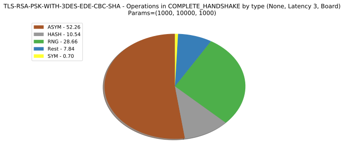
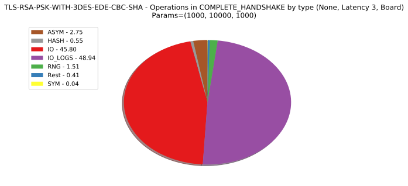
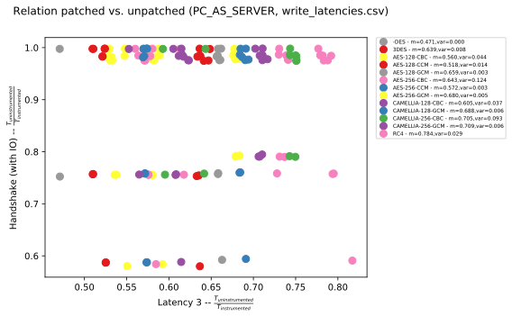

Outline
1. Motivation & Hypothesis
2. TLS protocol background
3. TLS library
4. Instrumentation
5. Experiment(s)
6. Results
7. Constraints / drawbacks
8. Outlook

--

Motivation
* IOT, Industry 4.0, cyber physical systems..
* huge number of: <!-- .element: class="fragment" data-fragment-index="1" -->
* resource constrained devices<!-- .element: class="fragment" data-fragment-index="1" -->
* connected to each other<!-- .element: class="fragment" data-fragment-index="1" -->
* bonus: real time requirements<!-- .element: class="fragment" data-fragment-index="1" -->

--

Question: What about sensitive data? / How to protect the communication?

--

Hypothesis: TLS is suited for the protection of resource-constrained realtime  systems
Note:
my super note

--

Why (not) TLS?
*  well known protocol
*  many implementations
*  considered to be slow <!-- .element: class="fragment" data-fragment-index="1" -->
*  and resource hungry <!-- .element: class="fragment" data-fragment-index="1" -->

--

objectives:
* resource constrained = limited RAM, persistent storage and computational capacity
* real time = fixed (and low!) latency

--

latency
* roughly: time between call of TLS library function until system IO function is reached
* channel establishment<!-- .element: class="fragment" data-fragment-index="1" -->
* exchange of user data  <!-- .element: class="fragment" data-fragment-index="1" -->

--

Verification in two steps:
1. development of a test bench <!-- .element: class="fragment" data-fragment-index="1" -->
2. evaluation of TLS on selected target platforms <!-- .element: class="fragment" data-fragment-index="2" -->

--

Brief background on TLS

--

* relevant sub protocols: Handshake & record layer protocol 

--

--

--

Why is the choice of cipher suite so important?
* one of the very few dynamic components
* cryptographic operations dominate the runtime
* test all cipher suite for influence on latency

--

# test bench
1. tls implementation
2. instrumentation
3. (now that we have the data..) comm protocol
4. software architecture (components)
5. correctness

--

TLS implementation
* OpenSSL (and derivates): too heavy <!-- .element: class="fragment" data-fragment-index="1" -->
* wolfSSL: suited for embedded environments, seems somewhat "hacky" <!-- .element: class="fragment" data-fragment-index="2" -->
* mbed TLS: ARM's official mbed library, supports almost all TLS features, felt convenient to use <!-- .element: class="fragment" data-fragment-index="3" -->

--

Instrumentation

--

How to instrument?
* callgrind: excellent tool, just too heavy
* gprof: had a lot of quirks, also not sure if available on target platforms
* considered other papers and their approach, none really suited mine
* black box approach: device in the middle ("proxy"), does not allow deep insight

--

Solution:
* small library linked to target code
* manual insertion of log points into the code
* relies on clock gettime call
* different clock modes (wall clock, NTP independent clock, process / thread time)
* general: metric function with monotonically rising values necessary

--

API
* log_point(label, ctx, payload)
* Usage 
        int my_function(...) {
            log_point(MY_FUNCTION_START, global_log_ctx, 0);
            // do stuff
            log_point(MY_FUNCTION_STOP, global_log_ctx, 0);
            return result;
        }

* log_point calls can be nested <!-- .element: class="fragment" data-fragment-index="2" -->

--

Logging labels
* translated before compile time 
* combination of identifier and type
* type can either be primitive or compound ("meta")
* example: 
        PERFORM_BENCHMARK,META
becomes

        enum logging_label {
            PERFORM_BENCHMARK_START = 0;
            PERFORM_BENCHMARK_STOP = 1;
        }

Note:
* typically with _START and _STOP suffixes
* depending on identifier, actual labels are generated
* additional features possible (e.g. for use during analysis)
* Data structures
* logging_context
* logging_entry
* payload
* field for additional information
* could be used for arbitrary types or information
* example: energy consumption value

--

Log trees

* nested log points form a log tree
* similar to matching many different parenthesises

--

Correctness (1)
* by instrumenting top-level "do_experiment_function", all execution time is taken into account
* from there, things get only more precise

Note:
* "How to ensure I haven't forgotten to instrument a major spot?"

--

completeness (2)
* a high level log block is made of primitive log blocks and time that's unaccounted for
* ratio between unaccounted time and time of primitive log blocks determine the coverage or insight into the target
* hence all time is measured. constraints: possibly I cannot figure the exact spot yet. can be fixed by adding more log points
* for this to work, target must be single-threaded (mbed TLS is)

--

Where to place the log points?

--

structure of mbed
* gained insight into library via callgrind (and KCachegrind)
* split into three libraries: crypto, tls, x509
* TLS protocols steps each have their own function 
* write_xy: caller sends the message xy, parse_xy: caller receives the message xy

--

placement of logs
* cover protocol step functions
* cover the whole crypto API
* idea: most time is spent in (a)symmetric crypto operations
* knowledge of protocol step sufficient, no general need for further insight

--

covering the crypto API
* mbed TLS comes with a built-in benchmark tool that measures raw crypto performance
* went through list of included header files to identify roughly all crypto functions
* perks: by instrumenting the function declaration and not explicit calls, all calls are
implicitly instrumented
* crypto functions considered to be "primitive" (no need to look insight them, impl. irrelevant)

--

Now we can instrument the implementation locally. What's next?

Let's take a look at the "other" side of the test bench!  <!-- .element: class="fragment" data-fragment-index="1" -->

--

Components of the test bench

--

--

--

--

--

experiment (1) (additional graphics)
* three parties: controller, TLS server and client
* controller loads list of all cipher suites
* controller sends current CS to client
* (number of iterations, total payload size, size of a single packet)
* here (1000, 10000, 1000)
* read: each cipher suite was measured 1000 times. During each iteration,
a total of 10000 bytes was exchanged, where each packet was 1000 byte large
* since TLS asymmetric protocol: roles change

--

Internally
* client initiates and proceeds handshake 10 times
* after each channel establishment, 10x 1KB dummy payload is sent from client to server
* repeat after all cipher suites were used
* then start again (total: 100 iterations)
* reason: whole experiment for single CS takes very long. By splitting up,
already measured logs can be processed. Also, an "open end" scenario is thinkable

--

# Evaluation
1. Methodology
1. results
2. overhead 
3. drawbacks

--

results
* server vs. client (handshake, payload)
* handshake vs payload
* type ratio
* hash vs sym
* stacked bar handshake proto steps
* density & histograms
* correlation time and packet no.

--

Overview of all cipher suites
* board perspective
* coloured by symmetric bulk cipher / key exchange method

--

--

--

--

--

Showing the single protocol step of a handshake for a single cipher suite

--

--

--

Overview of the internals during a handshake (cipher suite: 147)

--

--

--

performance impact
* measured on two levels
* micro: run two crypto functions (slow, fast) with different forms of logging
* different forms = no logging, logging with metric function, two different clock modes
* macro: compare the runtime of an instrumented version of mbed TLS with an instrumented

--

micro
* mean of N=1000000 runs
<table>
<tr>
    <td>Operation</td>
    <td>Raw (ns)</td>
    <td>Monotonic / Raw</td>
    <td>Monotonic Coarse / Raw</td>
</tr>
<tr>
    <td>SHA256</td>
    <td>1266.5ns</td>
    <td>1.114</td>
    <td>1.090</td>
</tr>
<tr>
    <td>3DES</td>
    <td>8799.2ns</td>
    <td>1.012</td>
    <td>1.007</td>
</tr>
</table>

--

macro
* instrumentation still takes place in bench process
* no deeper insight possible (IO ?)
* compare handshake and read and write latency

--

overhead, pc as server, board side

--

overhead sym, pc as server, board side

--

overhead, pc as server, pc side

--

overhead sym, pc as server, pc side

--

verification
* measure overhead (micro & macro scale)
* dependency of proto steps on cipher suite
* argumentative
* unaccounted areas

--

constraints:
* certain dependencies on target environment
* noise by OS (scheduling!) included

--

future work:
* stream ciphers
* TLS extensions (session caching)
* DTLS

--

portability and flexibility:
* requirements on metric function: monotonic rising
* POSIX
* other clock functions (process time) or even metrics (energy possible)

